

# Structure Porter

A simple texture pack designed to reveal the hidden import and export buttons
on structure blocks!

### Features

- Export structures as `.mcstructure` files.
- Load structures across different worlds.
- Utilize `.mcstructure` for your GameTest or other add-ons.

This add-on has been tested and functions correctly with Minecraft: Bedrock
Edition 1.20.50 and above, expected to work with 1.19.60.3 and above.

### Installation

Follow these steps:

1. Download the texture pack from the [releases section][releases], choosing
   the version that matches your Minecraft version.
2. Import the texture pack into Minecraft.
3. Activate it in your world or Global Resources.
     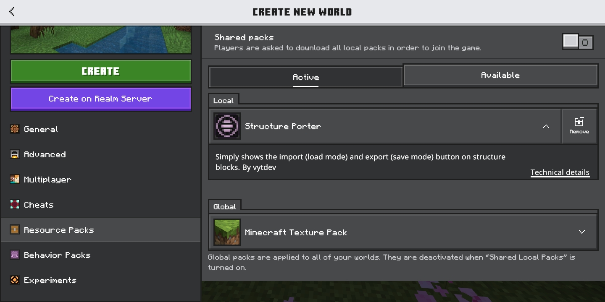
     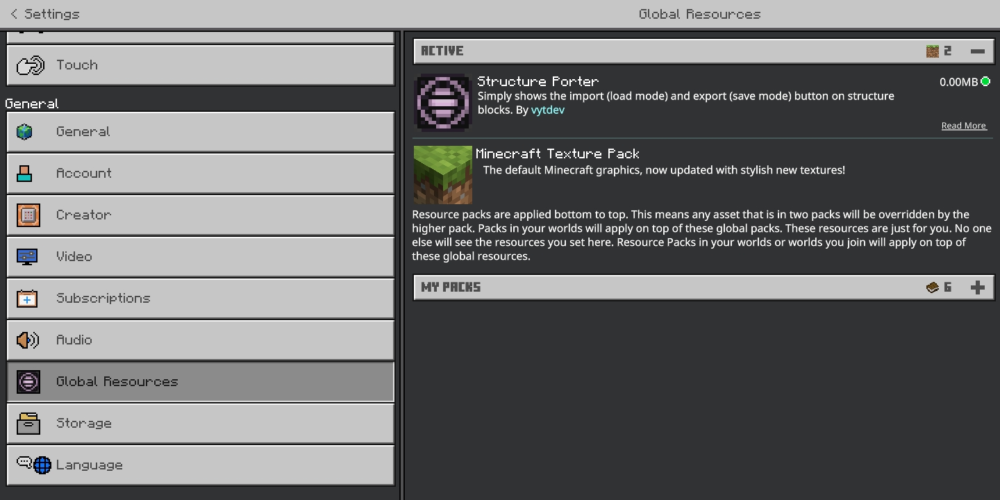

Now you're done setting it up!

### Exporting Structures

Here's how to export structures:

1. Obtain a structure block.
     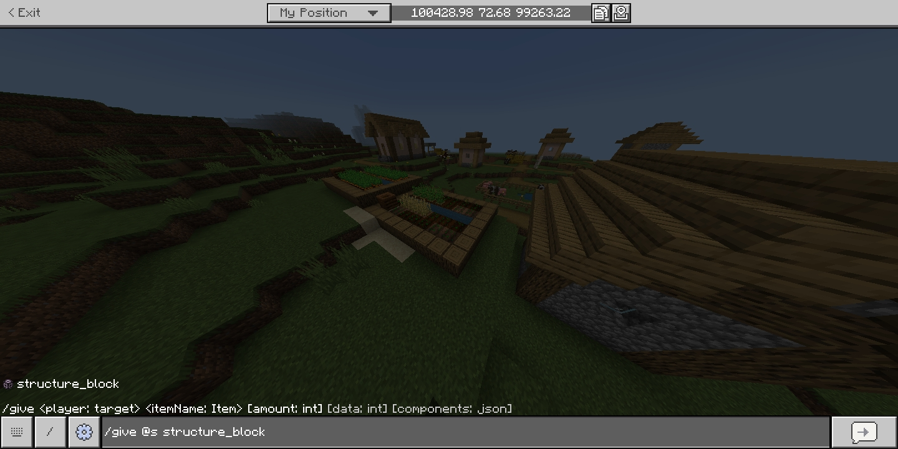
2. Set up your structure.
     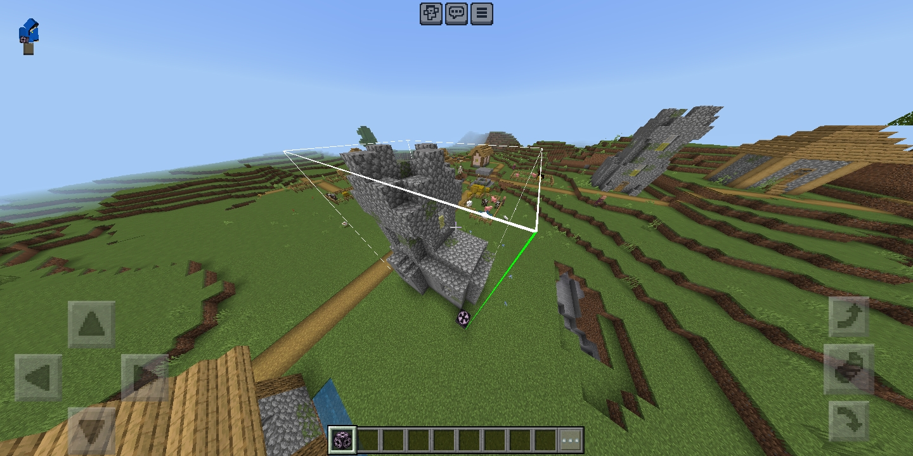
3. Name your structure and click/tap "Export".
     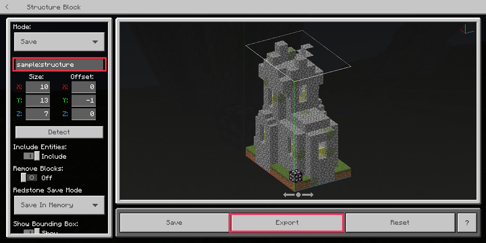
4. Save the structure file.
     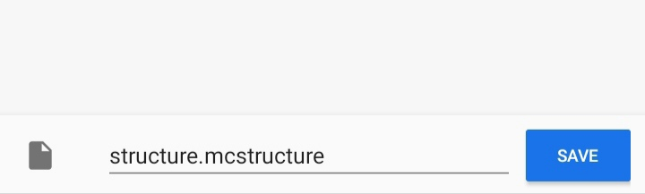

Now you have the `.mcstructure` file! There are two ways to use your structure:

1. Load it in another world.
2. Use it as an asset for your GameTest or other packs.

### Importing Structures

Here's how to load your structure into another world:

1. Obtain a structure block and place it anywhere you want.
     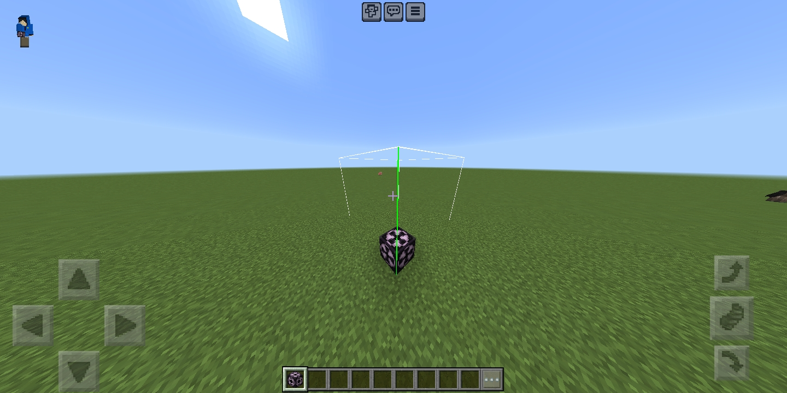
2. On the structure block, select load mode and click/tap "Import".
     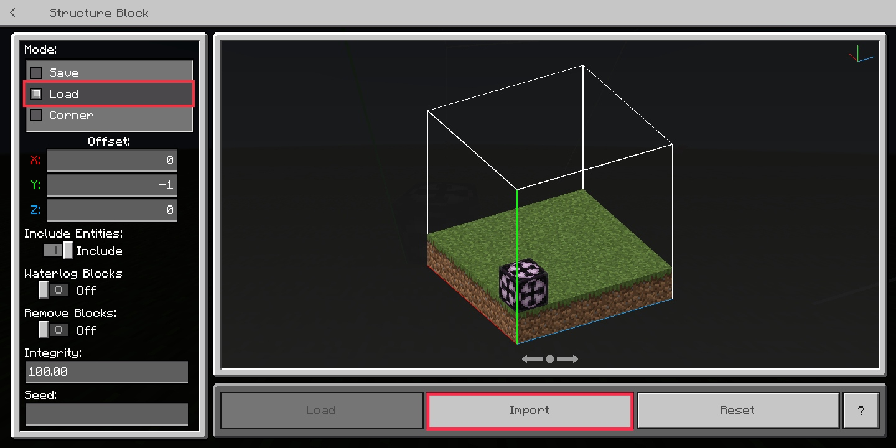
3. Choose your structure file.
     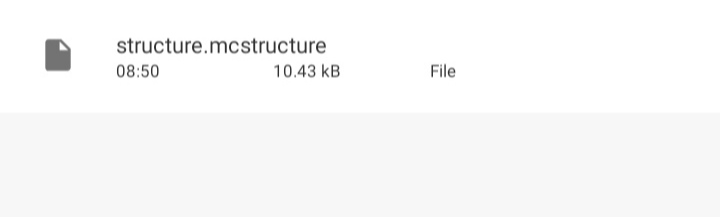
4. Tap the load button (do not rename it).
     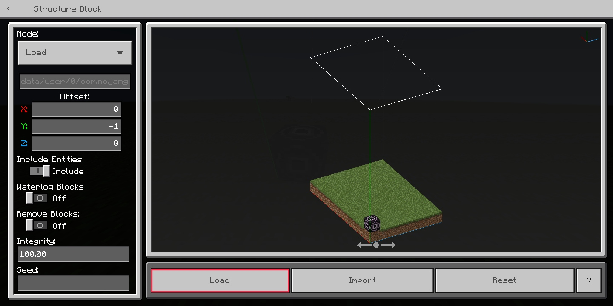

Now you have it! You've successfully copied a structure across your two worlds!

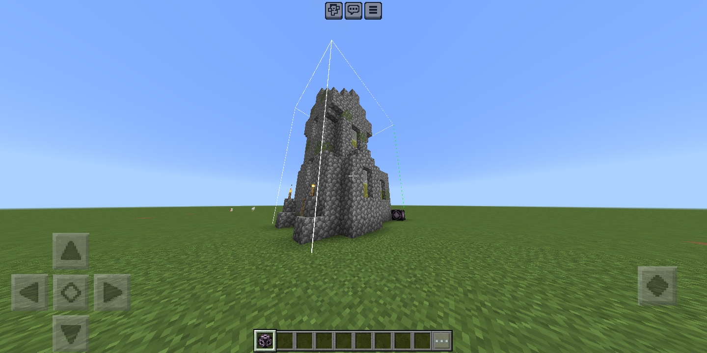

### Contribution

Any contribution is greatly appreciated! Feel free to contribute to the add-on!

### License

Copyright &copy; 2024 Vincent Yanzee J. Tan. Licensed under the MIT License.
See [LICENSE](LICENSE) for more details.

[releases]: https://github.com/vytdev/structure-porter/releases
